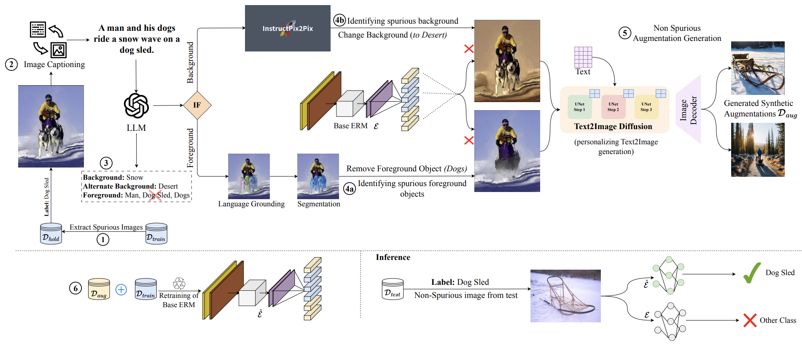

# ASPIRE
Code for the paper: [ASPIRE: Language-Guided Data Augmentation for Improving Robustness
Against Spurious Correlations](https://arxiv.org/pdf/2308.10103)



## Image Captioning

```
python image_captioning/caption_images.py \
-i <input_image_file_path> \
-o <output_file_path>
```

Each line in the input file should contain path to an image to be captioned. For example of the format please look at: `examples/example_caption_output.csv`

## Extracting objects and backgrounds from captions.
We use the following prompt with GPT-4 to identify forground objects, backgrounds and suggestions for alternate backgrounds for captions generated for images in the above step:

```
I will provide you with a list of tuples. Each tuple in the list has 2 items: the first is a caption of an image and the second is the label of the image. For each, you will have to return a JSON with 3 lists. One list should be the list of all phrases from the caption that are objects that appear in the foreground of the image but ignore objects that correspond to the actual label (the label for the phrase might not be present exactly in the caption) (named ’foreground’). The second list should have the single predominant background of the image to the foreground objects (named ’background’). If you do not find a phrase that corresponds to the background, return an empty list for the background. The third is an alternative background for the image, an alternative to the background you suggested earlier (named ’alt’). Here are some examples which also show the format in which you need to return the output. Please just return the JSON in the following format: {"foreground": ["woman", "plaid kilt"], "background": ["forest"], "alt": ["city streets"]}, {"foreground": ["dog", "coke can"], "background": ["bed"], "alt": ["playground"]}  and here is the caption: {caption}.
```

## Spurious Object Detection:

For input file format please check: `examples/example_spurious_object_detection_input.json`.

1. For CelebA dataset:
```
python Grounded-Segment-Anything/Inpaint-Anything/spurious_objects_detection_celeba.py \
--input_file <path_to_input_file> \
--dataset <name of dataset - celeba> \
--image_output_path <path to save modified images> \
--model_ckpt_path <path to model checkpoint> \
--dilate_kernel_size 10 \
--output_dir <path to output> \
--sam_ckpt <path to SAM model>\
--seed 42 \
--lama_config <path to lama_config file> \
--lama_ckpt <path to lama checkpoint> \
--grounded_checkpoint <path to grounded checkpoint> \
--config ../GroundingDINO/groundingdino/config/GroundingDINO_SwinT_OGC.py

python Grounded-Segment-Anything/Inpaint-Anything/parse_top_k_classes_celeba.py \
--wrong_preds_jsonl_path <path to output jsonl of the previous command> \
--spurious_image_saved_path <value of --image_output_path from the previous command> \
--non_spurious_images_save_path <output path to save non-spurious images>
```

2. For other datasets:
```
python Grounded-Segment-Anything/Inpaint-Anything/spurious_objects_detection.py \
--input_file <path_to_input_file> \
--dataset <name of dataset - imagenet, waterbird, spuco_dogs> \
--image_output_path <path to save modified images> \
--model_ckpt_path <path to model checkpoint> \
--dilate_kernel_size 10 \
--output_dir <path to output> \
--sam_ckpt <path to SAM model>\
--seed 42 \
--lama_config <path to lama_config file> \
--lama_ckpt <path to lama checkpoint> \
--grounded_checkpoint <path to grounded checkpoint> \
--config ../GroundingDINO/groundingdino/config/GroundingDINO_SwinT_OGC.py

python Grounded-Segment-Anything/Inpaint-Anything/parse_top_k_classes.py \
--dataset <name of dataset - imagenet, waterbird, spuco_dogs> \
--wrong_preds_jsonl_path <path to output jsonl of the previous command> \
--spurious_image_saved_path <value of --image_output_path from the previous command> \
--non_spurious_images_save_path <output path to save non-spurious images>
```

## Diffusion Fine-tuning and Augmentation
1. Finetuning diffusion model with non-spurious images.
```
cd diffusion_generation/

sh transcribe.sh
```

Before running the above script please fill in the values for args: `dataset, train_data_dir` and `output_dir`.

2. Image generation from fine-tuned models:
```
python diffusion_generation/generate_images.py \
--model_ckpt <path to finetuned model ckpt> \
--out <path to output folder> \
```

## DFR Training:

1. For DFR training on only train set:
```
python deep_feature_reweighting/dfr_evaluate_spurious.py \
--data_dir=<path_to_data_dir> \
--result_path=<path_to_output_results> \
--ckpt_path=<path_to_model_ckpt> \
--tune_class_weights_dfr_train
```

2. For DFR training on only augmentation set:
```
python deep_feature_reweighting/dfr_evaluate_spurious_aug_only.py \
--data_dir=<path_to_data_dir> \
--augset_dir=<path_to_aug_data_dir> \
--result_path=<path_to_output_results> \
--ckpt_path=<path_to_model_ckpt> \
--tune_class_weights_dfr_train
```

3. For DFR training on train+augmentation set:
```
python deep_feature_reweighting/dfr_evaluate_spurious_full.py \
--data_dir=<path_to_data_dir> \
--augset_dir=<path_to_aug_data_dir> \
--result_path=<path_to_output_results> \
--ckpt_path=<path_to_model_ckpt> \
--tune_class_weights_dfr_train
```

## 🌻 Acknowledgement  
We use the code from the following repositories: [Grounded-Segment-Anything](https://github.com/IDEA-Research/Grounded-Segment-Anything), [Inpaint-Anything](https://github.com/geekyutao/Inpaint-Anything), [Instruct-pix2pix](https://github.com/timothybrooks/instruct-pix2pix) and [Deep-Feature-Rewieghting](https://github.com/PolinaKirichenko/deep_feature_reweighting).

Please cite the above repositories if you find their code useful.

## 🔏 Citation    
```
@misc{ghosh2024aspirelanguageguideddataaugmentation,
      title={ASPIRE: Language-Guided Data Augmentation for Improving Robustness Against Spurious Correlations}, 
      author={Sreyan Ghosh and Chandra Kiran Reddy Evuru and Sonal Kumar and Utkarsh Tyagi and Sakshi Singh and Sanjoy Chowdhury and Dinesh Manocha},
      year={2024},
      eprint={2308.10103},
      archivePrefix={arXiv},
      primaryClass={cs.CV},
      url={https://arxiv.org/abs/2308.10103}, 
}
```